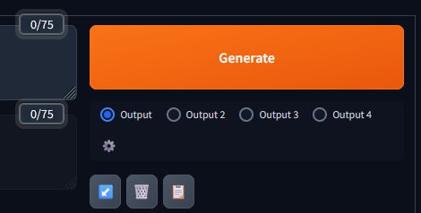
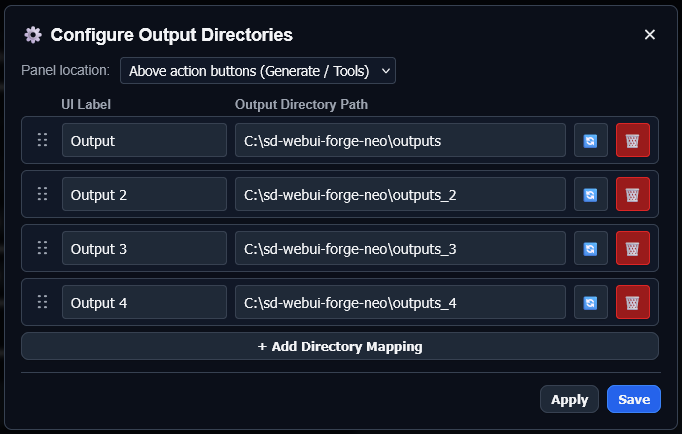

# Output Folder Switcher for SD WebUI Forge Neo

## Features

* Configurable panel with selectable output folders options.
> [!NOTE]
> For now this plugin only changes paths to "outputs" and keep inner folders order same as default (txt2img-images, img2img-images, extras-images, videos, txt2img-grids, img2img-grids, _2/_3, init-images)

## Changelog

<b>v1.0.0 — Initial Release</b>

 

* **Core Features**
  * Added configurable panel with selectable output folders options
  * Added configuraion menu where user can confugure any output name and folder

## Installation
1. Open SD Webui Forge Neo
2. Go to Extensions → Install from URL
3. Paste: `https://github.com/diamfang/sd-webui-folder-switcher`
4. Click Install, then reload the WebUI

> [!WARNING]
>This extension was tested only for Forge Neo. I cannot guarantee that it will work for Automatic1111 or Forge Classic.

## Credits
* [Forge Neo](https://github.com/Haoming02/sd-webui-forge-classic/tree/neo) by Haoming02
